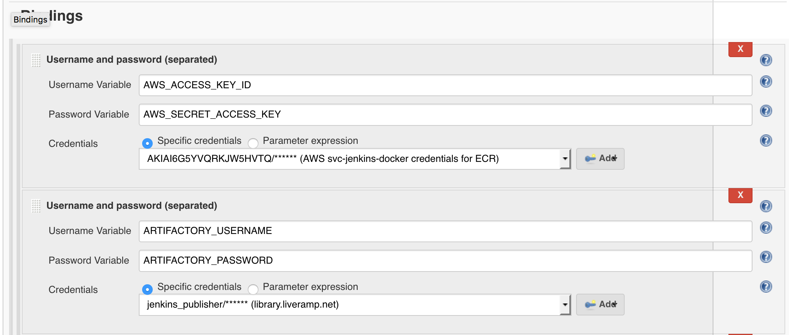

# Changelog

<!-- TOC -->

* [2.2.0](#220)
  * [New Features](#new-features)
* [2.x](#2x)
  * [Upgrade Guide](#upgrade-guide)
  * [Non-breaking deprecation warnings](#non-breaking-deprecation-warnings)
  * [Breaking Changes](#breaking-changes)
  * [Capfile Changes](#capfile-changes)
    * [`kdt`](#kdt)
    * [`kdt toolbox`](#kdt-toolbox)
    * [`kdt push`](#kdt-push)
    * [`kdt generate`](#kdt-generate)
    * [`kdt publish`](#kdt-publish)
    * [`kdt deploy`](#kdt-deploy)
* [1.4.x](#14x)
  * [Breaking Changes](#breaking-changes-1)
* [1.3.x](#13x)
  * [Breaking Changes](#breaking-changes-2)
  * [New Features](#new-features-1)
  * [New Fixes](#new-fixes)

<!-- /TOC -->

## 2.2.0

### New Features
* `kdt deploy` will retry `kubectl apply -f` on failure due to failures from
  GKE API rate limits

## 2.x

### Upgrade Guide
* Run `kdt upgrade` to upgrade your v1 deploy.yml to a compatible v2
  deploy.yaml.

### Non-breaking deprecation warnings
* `kdt publish_containers` renamed to `kdt push`. The former subcommand will
  be removed in 3.0, but continues to work for now.
* `kdt render_deploys` renamed to `kdt generate`. The former subcommand will
  be removed in 3.0, but continues to work for now.
* `kdt publish_artifacts` renamed to `kdt publish`. The former subcommand will
  be removed in 3.0, but continues to work for now.
* `kdt sweeper` renamed to `kdt expire`. The former subcommand will
  be removed in 3.0, but continues to work for now.
* `kdt templater`, `kdt render_deploys_hook`, and `kdt make_configmap` are
  disappearing in 3.0 and have been marked as such. They remain for now.
* `deploy.yml` is deprecated in favor of `deploy.yaml`. Run `kdt upgrade` to
  fix.

### Breaking Changes
* For `kdt deploy`, `--context` is now a required argument.
  * To view your contexts, see `kubectl config get-contexts`.
* For `kdt publish_container`, in `deploy.yaml`,
  * `image_registries` has been added as a mandatory entry in each deploy.yaml.
    KDT no longer has built-in knowledge about any image registry target and
    you must specify your own.

For example,
```yaml
image_registries:
  - name: aws
    driver: aws
    prefix: ***REMOVED***
    config:
      region: us-west-2
  - name: gcp
    driver: gcp
    prefix: ***REMOVED***
```

* You must add any new configuration for a cluster deploy target in `deploy.yaml`
as a new concept called an `artifact`.

For example,
```yaml
artifacts:
  - name: dist-prod
    image_registry: gcp
    flags:
      target: ***REMOVED***-dist
      environment: prod
      cloud: gcp
      pull_policy: IfNotPresent
  - name: dist-staging
    image_registry: gcp
    flags:
      target: ***REMOVED***-dist
      environment: staging
      cloud: gcp
      # ... etc
```

`.deploy.clusters` has been renamed to `.artifacts`, and the concept of
a combination of `--target`, `--environment`, and `--flavor` has been
removed and replaced by the concept of an artifact.

This `deploy.yaml` change precipitates into `kdt render_deploys`,
`kdt publish_artifacts`, and `kdt deploy`, as in the example below.

*Note that old artifacts generated by KDT 1.x will not be deployable by KDT 2.x,
and you'll have to deploy such artifacts with KDT 1.x.*

```bash
kdt render_deploys
# each named artifact is output to a directory like build/kubernetes/artifact
# instead of build/kubernetes/target/environment/flavor/

kdt publish_artifacts
# each named artifact is published

kdt deploy \
  --project=<project> \
  --build=<build> \
  --artifact=<artifact> \
  --context=<context>
# the named artifact is deployed to the specified context

```

* For `kdt render_deploys` and `kdt deploy`, `--include`, `--exclude`,
`--include-dir`, and `--exclude-dir` are now supported.

* For `kdt render_deploys`, in `deploy.yaml`, `.artifacts` supports
optional `.include_dir` and `.exclude_dir` fields.

For example, an artifact containing only the `nginx/` directory can be specified
as:

```yaml
artifacts:
  - name: dist-staging
    image_registry: gcp
    flags:
      target: ***REMOVED***-dist
      environment: staging
      cloud: gcp
    include_dir:
      - nginx/
```

* For `kdt render_deploys`, in `deploy.yaml`,
  * `extra_flags` has been renamed to `flags`
  * `target`, `environment`, `cloud`, and `pull_policy` are required `flags`

For example,
```yaml
artifacts:
  - name: colo-service-prod
    image_registry: aws
    flags:
      target: colo-service
      environment: prod
      cloud: colo
      pull_policy: IfNotPresent
```

* `image_registry` has been moved from `.artifacts[].flags.image_registry` to `.artifacts[].image_registry`. Along with this change, `.artifacts[].image_registry`  should map to what is defined as a valid image registry under `.image_registries[].name`. Example: gcp, aws, local, artifactory etc

* `kdt render_deploys`: the ERB templater helper method `config.get_or_nil`
has been completely deprecated in favor of `config.extra_flag`

### Capfile Changes
For deployments in pentagon that used kdt 1.x, you will need to change the Capfile to allow deployment using kdt 2:

* References to `target`, `environment` and `flavors` must be removed
* `artifact` and `context` parameter must be specified:
    - `artifact` is the artifact defined in `deploy.yaml` that you want to deploy
    - `context` is a reference to the kubernetes cluster that you can target. For colo prod, set it to `rapleaf@prod.service`

[Example] of such a change.

[Example]: https://git.***REMOVED***/MasterRepos/pentagon/pull/1130/files

#### `kdt`

* kdt will now only surface the `kdt` binary as a singular entrypoint. This means
  that if you were previously invoking the kdt subcommands directly (eg.
  `bundle exec publish_container` or
  `bundle binstub kube_deploy_tools && bin/render_deploys`) then you will be
  unable to invoke the binaries.

  The fix is to modify your build script to execute commands through the kdt
  entrypoint. For instance:

  ```bash
  bundle exec publish_artifacts

  # becomes

  bundle exec kdt publish
  ```

  Please search for invocations of the following binaries and update them to use
  the kdt entrypoint with the new KDT names.

  ```
  deploy => kdt deploy
  make_configmap => kdt make_configmap
  publish_artifacts => kdt publish
  publish_container => kdt push
  render_deploys => kdt generate
  render_deploys_hook => kdt render_deploys_hook
  sweeper => kdt expire
  templater => kdt templater
  ```

#### `kdt toolbox`
* `kdt toolbox` is no longer part of KDT. It relied on a data model which we
  have discarded in 2.x (the concept of target/environment being linked
  to a specific registry.)

#### `kdt push`
* In deploy.yaml, `image_registries` has been added as a mandatory entry.yaml.
  KDT no longer has built-in knowledge about any image registry target and
  you must specify your own. Run `kdt upgrade` to fix.

  For example,
  ```yaml
  image_registries:
    - name: aws
      driver: aws
      prefix: ***REMOVED***
      config:
        region: us-west-2
    - name: gcp
      driver: gcp
      prefix: ***REMOVED***
  ```

* The Docker image pushed with a tag that no longer contains the current branch,
  but only the git sha and Jenkins build id.

  e.g.
  ```bash
  # old pseudo command
  docker tag local-registry/my-app upstream-registry/my-app:<$GIT_BRANCH + $GIT_SHA + $JENKINS_BUILD_ID>

  # new pseudo command
  docker tag local-registry/my-app upstream-registry/my-app:<$GIT_SHA + $JENKINS_BUILD_ID>
  ```

* `kdt push` will push the specified image to all configured image registries in
  deploy.yaml if one or more `--registry` flags are omitted at runtime.

#### `kdt generate`

* In deploy.yaml, `.deploy.clusters` has been replaced by a new concept
  called an `artifact`. Run `kdt upgrade` to fix.

  For example,
  ```yaml
  artifacts:
    - name: dist-prod
      flags:
        target: ***REMOVED***-dist
        environment: prod
        cloud: gcp
        image_registry: ***REMOVED***
        pull_policy: IfNotPresent
    - name: dist-staging
      flags:
        target: ***REMOVED***-dist
        environment: staging
        cloud: gcp
        # ... etc
  ```

  The concept of a combination of `--target`, `--environment`, and `--flavor`
  has been removed and replaced by the concept of an artifact.

  As a result, the file path of the generated artifacts has changed:

  ```bash
  kdt generate
  # each named artifact is output to a directory like build/kubernetes/artifact
  # instead of build/kubernetes/target/environment/flavor/
  ```

* For `kdt generate`, `--include`, `--exclude`, `--include-dir`, and
  `--exclude-dir` are now supported flags.
  * Similarly, in `deploy.yaml`, `.artifacts` supports optional
    `.include_dir` and `.exclude_dir` fields.

  For example, an artifact containing only the `nginx/` directory can be specified
  as:

  ```yaml
  artifacts:
    - name: dist-staging
      flags:
        target: ***REMOVED***-dist
        environment: staging
        cloud: gcp
      include_dir:
        - nginx/
  ```

* In `deploy.yaml`, `extra_flags` has been renamed to `flags`. Run `kdt upgrade`
  to fix.

  For example,
  ```yaml
  artifacts:
    - name: colo-service-prod
      flags:
        target: colo-service
        environment: prod
        cloud: colo
        image_registry: 123456789.dkr.ecr.us-west-2.amazonaws.com
        pull_policy: IfNotPresent
  ```

* The `config['image_tag']` value no longer contains the current branch,
  but only the git sha and Jenkins build id.

* The ERB templater helper method `config.get_or_nil` has been removed
  in favor of `config.extra_flag`

#### `kdt publish`

* Due to the new concept of an artifact as described in the previous section
  above, old artifacts generated by KDT 1.x will not be deployable by KDT 2.x,
  and you'll have to deploy such artifacts with KDT 1.x.*.

  ```bash
  kdt publish
  # results in each artifact published to the artifact registry under a new path
  # keyed by the artifact name instead of the deprecated "target" and "environment"
  ```

#### `kdt deploy`

* Due to the new concept of an artifact as described in the previous section
  above, old artifacts generated by KDT 1.x will not be deployable by KDT 2.x,
  and you'll have to deploy such artifacts with KDT 1.x.*.

* For `kdt deploy`, `--context` is now a required argument and no longer
  inferrable by KDT.
  * To view your contexts, see `kubectl config get-contexts`.

  ```bash
  kdt deploy \
    --project=<project> \
    --build=<build> \
    --artifact=<artifact> \
    --context=<context>
  # the named artifact is deployed to the specified context
  ```

* For `kdt deploy`, `--include`, `--exclude`, `--include-dir`, and
`--exclude-dir` are now supported flags.

## 1.4.x

### Breaking Changes
kdt will now default to an image pull policy of  `IfNotPresent`,changed from `Always`.

Any yaml templates using `imagePullPolicy: <%= config["pull_policy"] %>` will now default to not pulling an image tag if that tag is already on the node.
* If you have always used kdt to template out the image tag of your containers, this change does not affect you.
* However, if you have been using a static image tag that you keep replacing and rely on `imagePullPolicy: Always` to update that tag on nodes, then you will have to set that explicitly in your kubernetes yamls

## 1.3.x

### Breaking Changes
Support for the Jenkins Generic Artifactory Integration is removed and
artifactory.json is no longer generated.

Instead, a new command `publish_artifacts` will upload release artifacts
to Artifactory.

In your Jenkins build script, add `bundle exec kdt publish_artifacts`.

Please make the following changes in your Jenkins build.

* Under Build Environment, un-check Generic Artifactory Integration to disable.
* Under Bindings, add a username and password (separated) with
`ARTIFACTORY_USERNAME` as the Username Variable,
`ARTIFACTORY_PASSWORD` as the Password Variable, and
`jenkins_publisher/****** (***REMOVED***)` selected as the specific
credentials. See below.




### New Features
* The new command `publish_artifacts` uploads release artifacts to Artifactory
* ERB trim mode is now enabled (`<% "ruby code" -%>` no longer leaves a newline when rendered)

### New Fixes
* `render_deploys` and `publish_container` can be called in any order in
a project's Jenkins build script because `render_deploys` no longer does
`rm -rf build/kubernetes/` to clean the entire directory and remove
the `images.yaml` artifact created by `publish_container`
