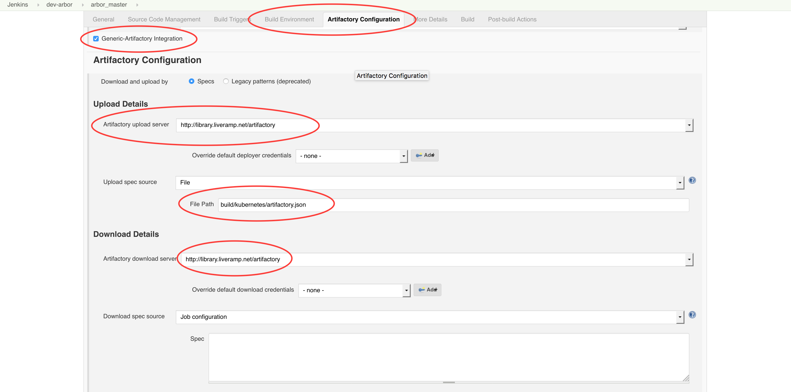
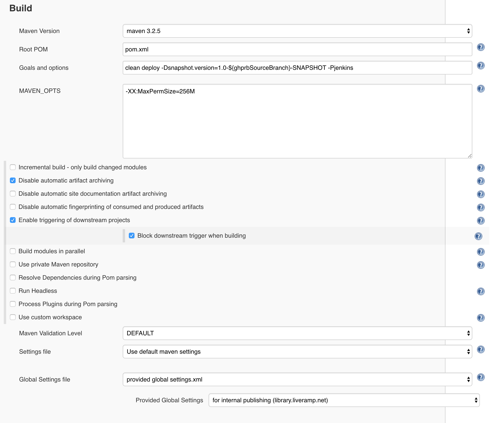

# Setup

The instructions below describe how to set up kube_deploy_tools in any generic
project build. Note that instructions are specified for Java projects where applicable.

After setup, see [documentation/deploy.md](deploy.md) for deploying your
project manually and setting up your Pentagon deploy.

* [Install the Gem](#install-the-gem)
* [Create deploy.yml](#create-deployyml)
* [Create Kubernetes manifests in kubernetes/](#create-kubernetes-manifests-in-kubernetes)
* [Directory structure](#directory-structure)
* [Jenkins build script](#jenkins-build-script)
* [Java projects](#java-projects)
  + [Java single-module projects](#java-single-module-projects)
  + [Java multi-module projects](#java-multi-module-projects)
  + [How do the Maven targets work?](#how-do-the-maven-targets-work)
* [Jenkins UI build steps](#jenkins-ui-build-steps)

## Install the Gem

Install the `kube_deploy_tools` gem in your project (or Java module)
by adding a Gemfile.

Gemfile:
```ruby
source 'https://gemserver.***REMOVED***'

group :kdt do
  gem 'kube_deploy_tools', '~> 2.0'
end
```

```bash
bundle install --with kdt --without default development test
```

## Create deploy.yml

Add a deploy.yml to your project (or Java module).

```bash
cat << EOF > deploy.yml
deploy:
  clusters:
    - target: local
      environment: staging
      extra_flags:
        image_tag: latest
    - target: colo-service
      environment: prod
    - target: colo-service
      environment: staging
  flavors:
    default: {}
EOF
```

Edit deploy.yml to only include the Kubernetes clusters where your project
runs e.g. be specific and choose colo and/or AWS.

For a full list of supported clusters, see
[examples/projects/deploy.yml](../examples/project/deploy.yml).

## Create Kubernetes manifests in kubernetes/

Use the `kubernetes/` directory for storing your Kubernetes manifests
in your project (or Java module).

File types can either be `.yaml` or `.yaml.erb`, and files may be stored into
subdirectories. For example:

```
kubernetes/
  configmap-my-todo-list.yaml
  my-todo-app/
    dep-my-todo-app.yaml.erb
    service-my-todo-app.yaml
```

See [documentation/kube_manifests_with_erb.md](kube_manifests_with_erb.md)
for writing Kubernetes manifests with ERB.

The manifests in the `kubernetes/` directory will be rendered by
`kube_deploy_tools` into the `build/kubernetes/` directory, where deploy
artifacts will be compressed and published to Artifactory.

Thus, add the `build/` directory to your .gitignore file.

## Directory structure

```
my-project/
  Gemfile                       # contains gem 'kube_deploy_tools'
  Gemfile.lock
  deploy.yml                    # deployment config for your project
  kubernetes/
  build/kubernetes/             # don't commit this directory, it's generated by kube_deploy_tools
  .gitignore                    # the build/ directory is git ignored
```

## Jenkins build script

Cross reference the KB page
[Migrating Backend Applications to Kubernetes](https://support.***REMOVED***/display/CI/Migrating+Backend+Applications+to+Kubernetes)
with `java_project_tools`, or `jpt`.

Jenkins build steps are required
1. to build, tag, and push all of your Docker images, and
2. to render and push all Kubernetes manifests.

For Java projects, see the Java projects section below for how to add these
build tasks to your Maven build.

For a generic, non-Java project, below are the additional commands required for your
build.

```bash
# In your project's Jenkins build script

# Build images
docker build -t local-registry/<image> # for each Docker image in your project
# Push images to image registry
bundle exec kdt publish_container --registry=<registry> <images...> # for all Docker images built in your project
# Render Kubernetes deploy artifacts
bundle exec kdt render_deploys
# Push Kubernetes deploy artifacts to Artifactory
bundle exec kdt publish_artifacts
```

See [documentation/deploy.md](deploy.md) for more on this topic.

## Java projects

Skip down to the Jenkins build steps section below for non-Java projects.

For single- and multi-module Java projects, a couple of further changes are
necessary.

For examples, see
- the single-module project [taxonomy_service](https://git.***REMOVED***/MasterRepos/taxonomy_service/pull/157/files), or
- the multi-module project [validator_service](https://git.***REMOVED***/MasterRepos/validator_service/compare/959b1e1bf54bd17760b2dac40d5c619d1bfa5a94...bff6f4b99bf0dcae961faca5551e5bc9a61f6ea9?diff=unified&expand=1&name=bff6f4b99bf0dcae961faca5551e5bc9a61f6ea9).

### Java single-module projects

For single-module projects, add the following flags to enable tasks to publish
Docker images to ECR and Kubernetes manifests to Artifactory:

```xml
  <properties>
    <skip.kdt.docker>false</skip.kdt.docker>
    <skip.kdt.kubernetes>false</skip.kdt.kubernetes>
    <docker.images>${project.artifactId}</docker.images>
  </properties>
```

The `<docker.images>` property is a list of space-separated image names. For
single-module projects, as done above, the Docker images built usually includes
only one that matches the name of the project artifact. If necessary,
add any further Docker images in your project.

Test this configuration by running the following:
```bash
mvn install
mvn exec:exec@kdt
bundle install
bundle exec kdt render_deploys
```

### Java multi-module projects
For multi-module projects, create a new submodule that runs last, as in the structure
below.

```
my_project/
  my_project_daemon/
    src/
    pom.xml              # (3) set <skip.kdt.docker> property to false
    Dockerfile
  my_project_lib/
    src/
    pom.xml
  my_project_server/
    src/
    pom.xml              # (3) set <skip.kdt.docker> property to false
    Dockerfile
  my_project_kubernetes/ # (1) create this new submodule, see below
    Gemfile
    deploy.yml
    kubernetes/
    build/kubernetes/
    pom.xml              # (4) set <skip.kdt.kubernetes> and <docker.images> properties, see below
  pom.xml
  Gemfile                # (2) necessary for Pentagon, see below
  .gitignore
```

(1) The Gemfile, deploy.yml, and kubernetes/ directory should be in the new
Kubernetes submodule.

(2) A Gemfile is required at the root of your project that references the
new Kubernetes submodule's Gemfile:

```ruby
eval_gemfile File.join(File.dirname(__FILE__), "my_project_kubernetes/Gemfile")
```

(3) For each submodule with a Docker image (i.e. Dockerfile), set
`<skip.kdt.docker>false</skip.kdt.docker>` to build the Docker image.
In the example above, this property is set for `my_project_daemon` and
`my_project_server`.

(4) For the new Kubernetes submodule (`my_project_kubernetes` in the example above),
add each submodule with a Docker image to the list of dependencies in
`<dependencies>` and the space-separated list of Docker images in
`<docker.images>`:


```xml
  <properties>
    <skip.kdt.kubernetes>false</skip.kdt.kubernetes>
    <docker.images>my_project_daemon my_project_server</docker.images>
  </properties>

  <dependencies>
    <dependency>
      <groupId>com.liveramp.my_project</groupId>
      <artifactId>my_project_daemon</artifactId>
      <version>1.0-SNAPSHOT</version>
    </dependency>

    <dependency>
      <groupId>com.liveramp.my_project</groupId>
      <artifactId>my_project_server</artifactId>
      <version>1.0-SNAPSHOT</version>
    </dependency>
  </dependencies>
```

Test this configuration by running the following:
```bash
mvn install
```

```bash
# for multi-module projects, run these commands from the Kubernetes submodule

mvn exec:exec@kdt

bundle install
bundle exec kdt render_deploys
```

### How do the Maven targets work?

The `<skip.kdt.docker>` and `<skip.kdt.kubernetes>` flags enable generating and
pushing Docker and Kubernetes release artifacts on `clean deploy -Pjenkins`.

In Jenkins master builds, this means pushing Docker images to ECR and pushing
rendered Kubernetes manifests to Artifactory.

In Jenkins PR builds, we recommend using the following mvn arguments:
`clean deploy -Dsnapshot.version=1.0-${ghprbSourceBranch}-SNAPSHOT -Pjenkins`

When working locally, use the plain `bundle` commands directly. For example:

```bash

bundle install

bundle exec kdt render_deploys

mvn install
bundle exec kdt publish_container --registry=aws my_project_daemon
```

For reference, see
[pom-common-core](https://git.***REMOVED***/MasterRepos/pom-common-core/blob/master/pom.xml)
and
[build_tools/.../kdt.sh](https://git.***REMOVED***/MasterRepos/build_tools/blob/master/src/main/resources/com/liveramp/build_tools/common/kdt.sh)
for the Maven build tasks.

## Jenkins UI build steps
Below are Jenkins build steps required for configuration in the Jenkins UI.

For examples of Jenkins configurations, see below.
* [ingestion_file_locator](https://jenkins.***REMOVED***/job/ingestion_file_locator/configure)
* [ingestion_file_locator_prs](https://jenkins.***REMOVED***/job/ingestion_file_locator_prs/configure)

#### (1) The Jenkins build should run on Docker-enabled Jenkins workers.
* Under General > Restrict where this project can be run,
set the Label Expression to `docker2`.

#### (2) Jenkins credentials are required for Github auth on `docker2` machines below.
* Under Credentials > Source Code Management > Git, select `rapleaf (RSA,  github)`.

#### (3) Jenkins credentials are required to publish your project's images to AWS ECR
and your project's deploy artifacts to Artifactory. See the image below and instructions.



* Under Build Environment, check Use secret text(s) or file(s).
* Under Bindings, select username and password (separated) with
`AWS_ACCESS_KEY_ID` as the Username Variable,
`AWS_SECRET_ACCESS_KEY` as the Password Variable, and
`.../****** (AWS svc-jenkins-docker credentials for ECR)` selected as the specific
credentials. See above.
* Under Bindings, select username and password (separated) with
`ARTIFACTORY_USERNAME` as the Username Variable,
`ARTIFACTORY_PASSWORD` as the Password Variable, and
`jenkins_publisher/****** (***REMOVED***)` selected as the specific
credentials. See above.

#### (4) For Java projects on `docker2` machines, the Artifactory configuration below is
required for pushing Java artifacts.

* Under Maven's build settings: Build > Advanced settings > Global settings.xml > Use
  provided settings.xml file, select `***REMOVED***`.

Otherwise you will get an error when mvn tries to publish artifacts to Artifactory.

